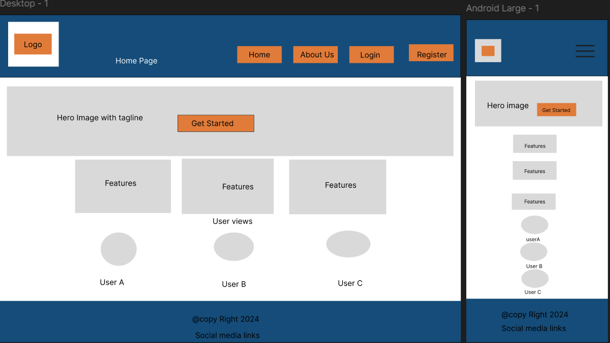

 # CareerTrack       

 ## Table of Contents

1. [Introduction](#introduction)
2. [User Experience Design](#user-experience-design)
3. [Wireframes](#wireframes)
4. [Agile Development Process](#agile-development-process)
5. [Features](#features)
6. [Testing](#testing)
7. [Known Bugs](#known-bugs)
8. [Additional Feature](#additional-features)
9. [Deployment](#deployment)
10.[Credit](#credits)

## Introduction

CareerTrack is a robust web application designed to streamline the job application process for users. It provides a platform for job seekers to manage and track their job applications effectively, helping them stay organized and informed throughout their job search journey. 

Built with Django, Bootstrap, and a responsive design in mind, CareerTrack aims to provide a seamless and intuitive user experience across all devices. Whether you're applying for your first job or switching careers, CareerTrack helps you keep track of all your job applications in one place, ensuring you never miss an opportunity.


## User Experience Design

### User Stories

- **As a new user**, I want to sign up easily so that I can start using the app.
- **As a returning user**, I want to log in quickly and securely to access my dashboard.
- **As a user**, I want to add job applications so that I can track them.
- **As a user**, I want to view the status of my job applications on my dashboard.
- **As an admin**, I want to manage users and view all job applications.
- **As an admin**, I want to be able to delete users if necessary.

### Wireframes

Wireframes were created during the planning phase to visualize the layout of key pages such as the home page, login, signup, user dashboard, and admin dashboard. Below are the wireframes:

- **Home Page**: 
- **User Dashboard**: 
- **Admin Dashboard**: 
                      
- **Job Application Management**: 

### User Flow Diagram

The user flow diagram illustrates the different pathways a user can take within the application, from registration to managing job applications:


### ERD Diagram

The Entity-Relationship Diagram (ERD) outlines the database structure of CareerTrack, including the relationships between users, job applications, and roles.


## Agile Development Process

CareerTrack was developed using Agile methodologies, with the project being divided into sprints. Each sprint focused on different aspects of the application, from user authentication to job application management.For user story management, I utilized GitHub's Project Board (also known as Kanban board) to organize and track the progress of tasks and user stories efficiently,[Here is the link of GitHub's Project Board](https://github.com/users/AshwiniTembhurne/projects/4/views/1)

### Sprint Overview

- **Sprint 1**: User authentication, registration, and basic dashboard setup.
- **Sprint 2**: Job application management features.
- **Sprint 3**: Admin panel and user management.
- **Sprint 4**: Responsive design and final testing.

## Features

- **User Registration and Authentication**: Secure registration and login system with user roles (admin and standard user).
### Sign up page

### Login page


- **User Dashboard**: Personalized user dashboard showing the status of job applications.
### User Dashboard

### Add application page 

### Edit application page

### View application page

- **Admin Panel**: An admin dashboard with additional controls, including user management and application tracking.Admin can use same login credential which is used in Django Login and add same login credential into Login page to view well structured Admin Dashboard where he/she can monitor all user activities.Here are the images of Admin dashboard  and user list page.
### Admin Dashboard

### User list


- **Job Application Management**: Users can add, edit, view, and delete job applications, along with the ability to track their status.
 ### Add Job Application : 
  - Here user can add  all the job application detail using Add application Form.
  
  ### Edit Job Application : 
  - Here user edit all the job application detail using Edit application Form
  
   ### View application page
   - Here user can view all the application list ,he/she added.
  
  ### Delete Option
  
- **Responsive Design**: Fully responsive design ensuring usability across mobile, tablet, and desktop devices.
   
   
   
   
- **Notifications**: Alert system for successful actions like logging in, signing up, and managing applications. Here are some example how my application respond in every actions.


## Contact us Form
- User can send there queries to using contact us form and it is manage by  Admin
! [contact us form](static/images/contact_us.png)
! [Django Admin Panel](static/images/django_admin.png)

## About us page

## Testing

### Manual Testing

#### 1. **User Registration and Login**
   - **Objective:** Ensure that users can register and log in to the application successfully.
   - **Steps:**
     1. Navigate to the registration page.
     2. Enter valid details (username, email, password, etc.) and submit the form.
     3. Verify that the registration is successful and the user is redirected to the login page.
     4. Log in with the newly created credentials.
     5. Ensure that the login is successful and the user is redirected to their profile or dashboard.
   - **Expected Result:** The user should be able to register, receive a confirmation email (if applicable), and log in successfully.
   
   
   
   
   
   
   
   
#### 2. **User List Display in Admin Dashboard**
   - **Objective:** Ensure that the admin can view the list of registered users.
   - **Steps:**
     1. Log in as a superuser/admin.
     2. Navigate to the admin dashboard.
     3. Click on the "User List" section.
     4. Verify that the list of registered users is displayed correctly.
   - **Expected Result:** The admin should be able to view all registered users, along with their details, in the user list.
   
   

#### 3. **User Edit Functionality in Admin Dashboard**
   - **Objective:** Ensure that the admin can edit user details.
   - **Steps:**
     1. Log in as a superuser/admin.
     2. Navigate to the admin dashboard and access the user list.
     3. Click on the "Edit" button for a specific user.
     4. Verify that the user details are displayed correctly on the edit page.
     5. Attempt to modify the user details and click "Save".
     6. **Known Bug:** Observe that the "Save" button may not be active, preventing form submission. This is a known issue and is currently being addressed.
   - **Expected Result:** Ideally, the admin should be able to edit and save user details. However, due to the known bug, this functionality may be impaired.
   

#### 4. **User Deletion in Admin Dashboard**
   - **Objective:** Ensure that the admin can delete users from the system.
   - **Steps:**
     1. Log in as a superuser/admin.
     2. Navigate to the admin dashboard and access the user list.
     3. Click on the "Delete" button for a specific user.
     4. Confirm the deletion in the confirmation dialog.
     5. Verify that the user is removed from the user list.
   - **Expected Result:** The admin should be able to delete users successfully, and the user should be removed from the database.
 
 
#### 7. **User Activity Monitoring in Admin Dashboard**
   - **Objective:** Ensure that the admin can monitor user activity through the dashboard.
   - **Steps:**
     1. Log in as a superuser/admin.
     2. Navigate to the admin dashboard.
     3. Access the user activity logs or monitoring section.
     4. Verify that user activities are being logged and displayed correctly.
   - **Expected Result:** The admin should be able to view detailed logs of user activities within the application.
   

#### 8. **Form Validation and Error Handling**
   - **Objective:** Ensure that forms throughout the application are validated correctly and appropriate error messages are displayed.
   - **Steps:**
     1. Attempt to submit forms (registration, login, etc.) with invalid or incomplete data.
     2. Verify that the form is not submitted and appropriate error messages are displayed.
   - **Expected Result:** Forms should not submit with invalid data, and users should be clearly informed of any errors.
   
   

#### 9. **Responsiveness and Cross-Browser Testing**
   - **Objective:** Ensure that the application is responsive and works across different devices and browsers.
   - **Steps:**
     1. Access the application on different devices (desktop, tablet, mobile) and in different browsers (Chrome, Firefox, Safari, Edge).
     2. Verify that the layout and functionality are consistent across all platforms.
   - **Expected Result:** The application should be fully responsive, with consistent functionality and layout across all devices and browsers.
   
   
   
   
### Summary of Testing Results

- **Pass:** All tested features, except the known bug with the user edit functionality in the admin dashboard, performed as expected.
- **Fail:** The "Save" button in the user edit form in the admin dashboard is not active, preventing form submission. This issue is being actively worked on.


### Issues and Resolutions

- **Responsive Issues**: Early testing revealed some issues with responsiveness on mobile devices. These were resolved by adjusting the CSS and using Bootstrap’s grid system.
- **Form Validation**: There were initial issues with form validation where users could submit forms without proper data. These were fixed by implementing Django's built-in form validation.

## Known Bugs

**Issue with User Edit Functionality in Admin Dashboard:**

There is a known bug in the admin dashboard where the "Save" button on the user edit page is not active or functional. When an admin attempts to edit a user's details, the form appears correctly, but clicking the "Save" button does not trigger the expected form submission or redirection to the user list page. This issue appears to be related to form validation or JavaScript interference, and debugging efforts are ongoing to resolve the problem. Despite this bug, user activity monitoring and other functionalities within the admin dashboard continue to work as expected.

## Additional Features

**Admin Dashboard for Monitoring User Activity:**

As an additional feature, this project includes an admin dashboard where superusers can monitor user activities, manage user accounts, and perform administrative tasks. The dashboard provides a comprehensive overview of user interactions within the platform, allowing admins to ensure smooth operation and security. This feature was designed to enhance the overall management capabilities of the application, making it easier for administrators to keep track of user behavior and maintain the system.


## Deployment

### Prerequisites

- **Python 3.8+**
- **Django 3.2+**
- **Bootstrap 5**

### Steps for Local Deployment

1. **Clone the repository**:
   ```bash
   git clone https://github.com/AshwiniTembhurne/career_track_project.git

2. **Navigate to your project directory**:
   cd careertrack

3. **Install dependencies**:
   pip install -r requirements.txt

4. **Run migrations**:
  python3 manage.py migrate

5. **Run the server**:
   python3 manage.py runserver

6. **Access the application**:
  Open your browser and go to https://8000-ashwinitemb-careertrack-kx3ckw94a2z.ws.codeinstitute-ide.net/

  ### Deployment on Heroku

1. **Create a Heroku app**:
  heroku create careertrack

2. **Push to Heroku**:
  git push heroku main

3. **Set up environment variables on Heroku**:
  Configure your database and other environment variables in the Heroku dashboard.

4. **Run migrations**:
  heroku run python manage.py migrate

5. **Open the app**:
  Visit deployed app using the URL provided by Heroku.


 ## CSS validation
  
  ## Credits

  - Django Documentation: For providing comprehensive guidance on building web applications with Django.
  - Bootstrap: For the responsive front-end framework used throughout the project.
  - Font Awesome & Bootstrap Icons: For providing the icons used in the application.
  - Favicon used in the application.
  - Figma for wireframes
  - canva for website images
  - W3School for sample code